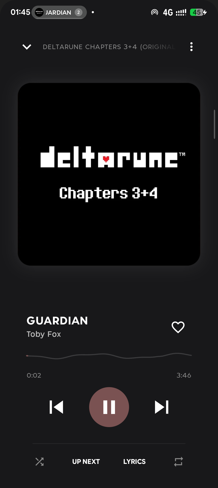
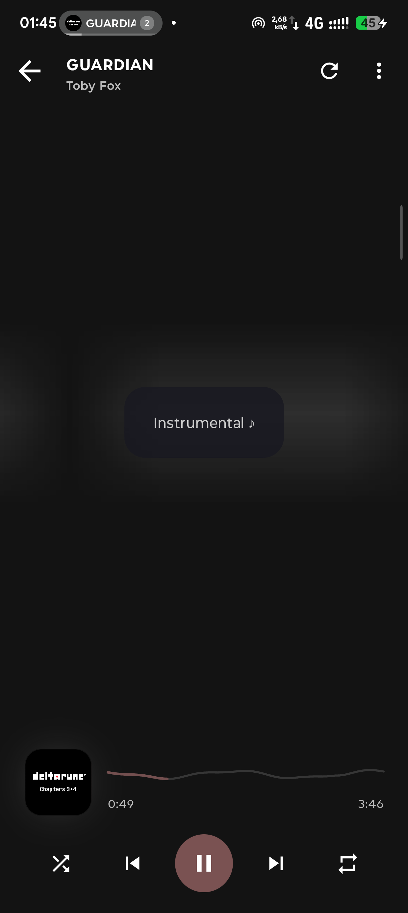
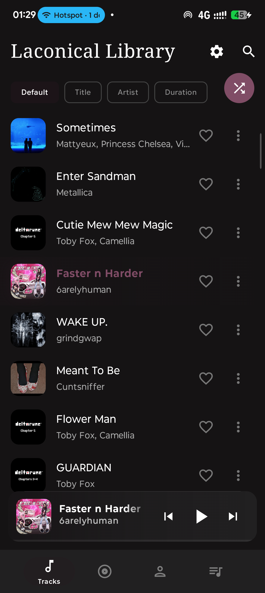
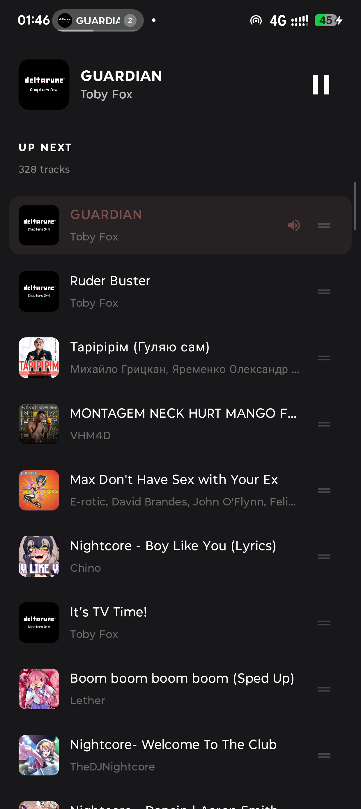
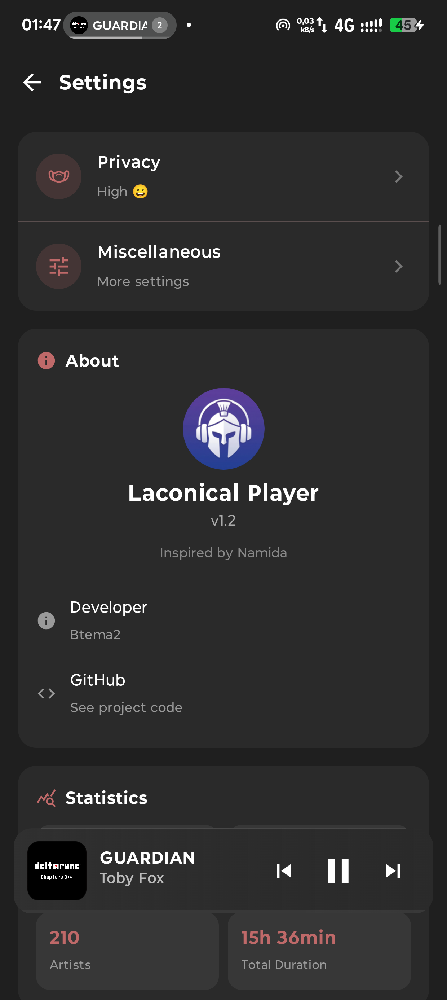
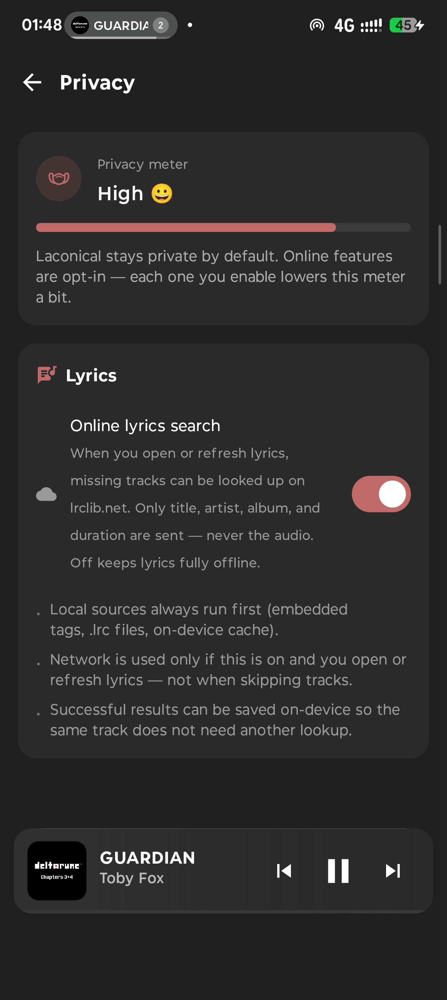
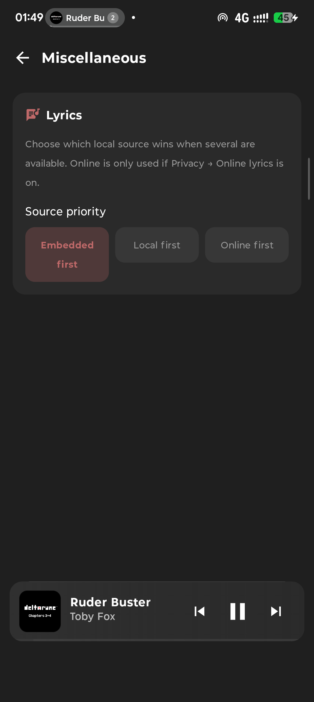

# 🎵 Laconical Player

[](https://github.com/Btema2/laconical-player/actions/workflows/ci.yml)
[](https://github.com/Btema2/laconical-player/releases/latest)
[](LICENSE)

A highly aesthetic, open-source Android music player. I built this because I care about the looks of my mp3 player and absolute privacy.

Built with **Kotlin**, **Jetpack Compose (Material 3)**, and **Android Media3 (ExoPlayer)**.

---

## 📸 Screenshots

<p align="center">
  
  
  
  
</p>

<details>
  <summary><b>Show More Screens (Settings, Privacy, Lyrics source priority)</b></summary>
  <br>
  <p align="center">
    
    
    
  </p>
</details>

---

## ✨ Features (What makes it good?)

* **Namida-Inspired Aesthetics**
  A UI that is actually alive. The player extracts the dominant color palette from your current track's album art on-the-fly and paints the interface with smooth gradients and glows.
* **Morphing Player Transition**
  A gorgeous custom transition (MiniPlayer ⟷ FullPlayer ⟷ Queue Sheet ⟷ Lyrics) built entirely on coordinate interpolation (`lerp`) between reported element positions — no sluggish Android shared-element APIs, no teleporting.
* **Synced Lyrics**
  Big, morphing lyrics view with an active-line highlight and tap-to-seek. Looks up embedded ID3/Vorbis tags, then a sibling `.lrc` file, then (only if you opt in) [LRCLIB](https://lrclib.net) — never audio, just title/artist/album/duration. Fetched lyrics are cached on-device so the same track never needs a second lookup.
* **Privacy Meter**
  A dedicated Privacy settings screen shows exactly how private you currently are, with every online feature (today: lyrics lookup) opt-in and off by default.
* **Dual-Layer Waveform Seeking**
  Two separate visualization layers: a static pre-decoded waveform seek bar powered by Amplituda, and a real-time audio visualizer driven by the Android `Visualizer` API. Fails safe to a smooth sine-wave when silent so it never looks dead.
* **Physics Particles**
  Floating particle fields on active track list rows and the full player, tied directly to playback state and audio amplitude.
* **60fps Pulsating Art**
  The album artwork scales and pulses in real time, synced perfectly to decoded waveform amplitude and playback.
* **Gesture-First Mini Player**
  Swipe left/right on the mini player to skip tracks, swipe down to dismiss, swipe up (from anywhere on the full player) to open the queue.
* **Sort & Shuffle Everywhere**
  Sort tracks, albums, artists, and playlists by title, artist, or duration, plus a one-tap shuffle-all on every list.
* **Offline & Privacy-First**
  No trackers, no analytics. Every online feature is opt-in and clearly labeled — by default your music and your listening habits never leave your device.
* **Zero Memory Leaks**
  Under the hood, we use serialized database operations, scoped coroutine lifecycles, and a single process-lifetime `MediaController` so the app won't hog your background RAM.

---

## 🛠️ Build It Yourself

Laconical Player is fully compilable locally.

### Prerequisites
- **Android Studio Ladybug** (or newer)
- Android SDK 36 installed

### Build Command
Compile the debug APK with:
```bash
./gradlew assembleDebug
```
The resulting APK will be at:
`app/build/outputs/apk/debug/app-debug.apk`

CI (lint, unit tests, debug build, CodeQL) runs on every push — see the badge above.

---

## 🧠 The "Vibe-Coding" Story
> This project has been heavily vibe-coded. I know more about music aesthetics and UI design than I do about the deep internals of the Android SDK.
>
> It started as a hobby project to learn and experiment. But as the architecture grew, I leaned on **Claude Code** and **Google Antigravity** to write the heavy-lifting, handle memory-safety, and wire up the low-level Android APIs. If the codebase looks like a sophisticated AI wrote it—it's because it did. I just make sure the music feels right.

---

## 📜 License
This project is licensed under the [GNU General Public License v3.0](LICENSE).
