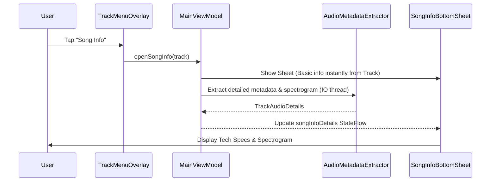

# Fancy Song Info Feature Design Specification

**Date:** 2026-08-04  
**Issue:** [#72](https://github.com/Btema2/laconical-player/issues/72)  
**Branch:** `feature-song-info-72`  
**Status:** Approved by User  

---

## 1. Overview

The **Fancy Song Info** feature adds a comprehensive audio metadata and technical visual inspection tool to Laconical Player. Accessible via a new **"Song Info"** option in the track 3-button menu (`TrackMenuOverlay`), it presents detailed track information divided into two intuitive categories: **Basic Info** and **Advanced Info**.

---

## 2. Architecture & Component Design

### 2.1 UI Layer
* **`TrackMenuOverlay.kt`**: Add a "Song Info" menu item (with info/analytics icon) between "Go to Artist" and "Add to Playlist". Tapping it triggers `onShowSongInfo(track)`.
* **`SongInfoBottomSheet.kt`** (`[NEW]` in `app/src/main/java/com/laconical/player/ui/components/`):
  * **Modal Container:** M3 `ModalBottomSheet` or styled full-width overlay card matching `LaconicalTheme` dark glassmorphism and the track's dominant color.
  * **Header:** Album art thumbnail, Track title, Artist name, close button, and a smooth 2-tab selector (`Basic` | `Advanced`).
  * **Basic Info Tab:**
    * **Track Metadata Card:** Title, Artist, Album, Album Artist, Genre, Track Number, Disc Number, Release Year.
    * **File Info Card:** Absolute File Path / Content URI, File Size (formatted in MB/KB), Duration, Container Format / MIME type, Date Added / Modified.
    * **Action Bar:** "Copy Path" and "Copy Full Metadata" buttons with toast/feedback.
  * **Advanced Info Tab:**
    * **Tech Specs Grid:** Bitrate (kbps, CBR/VBR), Sample Rate (Hz/kHz), Channels (Stereo/Mono/5.1), Bit Depth (16/24-bit), Audio Codec (MP3, FLAC, AAC, Opus, etc.).
    * **Spectrogram / Frequency Heatmap Visualizer Canvas:** Custom Compose `Canvas` rendering multi-band frequency spectrum heatmap / audio amplitude profile over time with frequency scale indicators.
    * **Loading / Asynchronous State:** Displays a sleek loading shimmer/spinner while background extraction executes.

### 2.2 Domain & Data Layer
* **`TrackAudioDetails.kt`** (`[NEW]` in `core/model/src/main/kotlin/com/laconical/player/core/model/`):
  * Data class containing detailed audio metadata:
    ```kotlin
    data class TrackAudioDetails(
        val track: Track,
        val filePath: String?,
        val fileSizeFormatted: String?,
        val mimeType: String?,
        val dateAddedFormatted: String?,
        val bitrateKbps: Int?,
        val sampleRateHz: Int?,
        val bitDepthBits: Int?,
        val channels: String?,
        val codec: String?,
        val albumArtist: String?,
        val composer: String?,
        val year: String?,
        val genre: String?,
        val discNumber: String?,
        val spectrogramFrequencies: FloatArray? = null
    )
    ```
* **`AudioMetadataExtractor.kt`** (`[NEW]` in `core/data/src/main/kotlin/com/laconical/player/core/data/`):
  * Uses `Context.contentResolver`, `MediaMetadataRetriever`, `MediaExtractor`, and file stat queries asynchronously on `Dispatchers.IO`.
  * Generates normalized frequency spectrum profile for the Spectrogram visualizer.

### 2.3 ViewModel Orchestration (`MainViewModel.kt`)
* StateFlow `selectedSongInfoTrack: StateFlow<Track?>` and `songInfoDetails: StateFlow<TrackAudioDetails?>`.
* Functions: `openSongInfo(track: Track)` and `closeSongInfo()`.

---

## 3. Data Flow



---

## 4. Design Verification & Self-Review

1. **Placeholder Scan:** All properties, components, and data flows explicitly defined. No TBD or TODOs.
2. **Internal Consistency:** Fits into existing `LaconicalTheme` and `MainViewModel` architecture without side effects.
3. **Scope Check:** Clear, targeted scope achievable cleanly across `:app`, `:core:model`, and `:core:data`.
4. **Ambiguity Check:** Explicit tab structure (Basic vs Advanced), clear file placement, and responsive UI feedback.
